# ⚡ Solana Raw Liquidity Sniper (Helius Free Tier Optimized)

> [!WARNING]
> **DISCLAIMER**: Questo software è fornito a scopo educativo e di ricerca. Il trading di criptovalute ad alta frequenza (HFT) e lo "sniping" comportano rischi elevati. Non investire fondi che non puoi permetterti di perdere. L'autore non è responsabile per eventuali perdite finanziarie derivanti dall'uso di questo bot.

## 📖 Panoramica

Questo è un bot di sniping ultra-ottimizzato per la blockchain Solana, progettato specificamente per operare entro i limiti del **Helius Free Tier** pur mantenendo performance competitive.

A differenza dei bot tradizionali che ascoltano i "Log" e fanno chiamate API lente per ottenere i dettagli del token, questo bot utilizza una tecnica di **Raw Memory Parsing**. Ascolta direttamente i cambiamenti di stato della memoria del programma Raydium e decodifica i dati della Pool localmente in **< 2ms**, eliminando la latenza di rete delle chiamate RPC standard.

## 🚀 Caratteristiche Chiave

- **Zero-Fetch Detection**: Identifica il token target direttamente dal payload WebSocket (Base64) senza chiamate HTTP aggiuntive (`getTransaction` o `getAsset`).
- **Helius Free Tier Friendly**: Utilizza WebSocket standard ottimizzati, evitando i costi del gRPC Enterprise.
- **Filtraggio Hardware-Level**: Filtra i pacchetti a monte per dimensione (752 bytes), ricevendo solo eventi di creazione Pool ed eliminando il rumore (swap, depositi).
- **Architettura Modulare**: Separazione netta tra Listener, Filtri di Sicurezza ed Executor.

## 🏗️ Architettura & Workflow

```mermaid
graph TD
    A[Solana Blockchain] -->|Helius WebSocket| B(Raw Listener)
    B -->|Filtro Server-Side: Raydium V4 + 752 Bytes| C{Nuovo Pacchetto?}
    C -->|Decodifica Base64 Locale| D[Memory Parser]
    D -->|Offset 400: Coin Mint| E[Estrazione Token]
    E -->|Offset 432: PC Mint| E
    E -->|Identificazione Coppia| F{Check: SOL Pair?}
    F -->|NO| G[Ignora]
    F -->|SI| H[🚀 TRIGGER BUY]
    H -->|Futuro: Jito Bundle| I[Esecuzione Block-0]
```



## 🛠️ Prerequisiti

- **Node.js** (v16 o superiore)
- **TypeScript** (`npm install -g typescript ts-node`)
- **Helius API Key**: Registrati gratuitamente su [dev.helius.xyz](https://dev.helius.xyz)
- **Wallet Solana**: Una chiave privata (formato Base58) con un minimo di SOL per le gas fee (per la fase di esecuzione)

## ⚙️ Installazione

1. **Clona o scarica la repository:**

```bash
git clone https://github.com/tuo-user/solana-raw-sniper.git
cd solana-raw-sniper
```

2. **Installa le dipendenze:**

```bash
npm install
```

3. **Configura le Variabili d'Ambiente:**

Crea un file `.env` nella root del progetto e inserisci i tuoi dati:

```env
# Helius RPC Configuration
# Sostituisci 'tua_api_key' con la tua chiave reale
HELIUS_API_KEY=tua_api_key
RPC_HTTPS=https://mainnet.helius-rpc.com/?api-key=tua_api_key
RPC_WSS=wss://mainnet.helius-rpc.com/?api-key=tua_api_key

# Wallet (Richiesto solo per moduli futuri di acquisto)
PRIVATE_KEY=tua_chiave_privata_base58
```

## 🖥️ Utilizzo

### 1. Avviare il Listener (Detection Mode)

Questo script ascolta la rete e stampa a schermo i nuovi token rilevati in tempo reale.

```bash
npx ts-node src/listener_raw.ts
```

**Output atteso:**

```
⚡ Connesso a Helius (Modalità RAW State)...
Target: Raydium V4 New Pools (Size: 752 bytes)

🚀 NUOVA POOL RILEVATA [Block-0 Candidate]
   Pool ID:    Hitv...
   Target:     DezX... (Indirizzo Token)
   Coppia:     TOKEN / SOL
   LP Mint:    5tbS...
```

## 🧠 Deep Dive Tecnico: La Strategia "Raw Memory"

### Perché questo approccio è più veloce?

#### Il Metodo Lento (Standard)

1. Il WebSocket invia un Log testuale: "Raydium: Initialize2"
2. Il bot riceve il log, ma non c'è l'indirizzo del token
3. Il bot deve fare una chiamata HTTP `getTransaction(signature)`
4. Latenza di rete: 200ms - 500ms
5. **Risultato**: Troppo tardi per il Blocco 0

#### Il Nostro Metodo (Raw Memory)

1. Ci iscriviamo a `programSubscribe` filtrando per `dataSize: 752` (la dimensione esatta in byte della struct di una Liquidity Pool Raydium V4)
2. Helius ci invia lo stato della memoria del nuovo account in Base64
3. Il bot converte Base64 in Buffer localmente (0ms di latenza rete)
4. Leggiamo i byte agli offset specifici:
   - **Offset 400**: Indirizzo Token A
   - **Offset 432**: Indirizzo Token B (Quote)
5. Tempo totale elaborazione: ~2ms
6. **Risultato**: Pronti per il Blocco 0

## 🗺️ Roadmap & Sviluppo Futuro

- [x] **Fase 1**: Setup ambiente e connessione WebSocket Helius
- [x] **Fase 2**: Implementazione Raw Parser per estrazione Token istantanea
- [ ] **Fase 3 (Filter)**: Integrazione controlli di sicurezza (Mint Authority, Liquidity Amount)
- [ ] **Fase 4 (Executor)**: Integrazione Jito Block Engine per l'invio di Bundle (Anti-Sandwich)
- [ ] **Fase 5 (Exit)**: Strategie di vendita automatiche (Take Profit / Stop Loss)

## 🔒 Sicurezza

- **Chiavi Private**: Le chiavi private sono gestite tramite variabili d'ambiente (`.env`) e non vengono mai caricate nel codice sorgente. Assicurati di aggiungere `.env` al tuo `.gitignore`
- **Codice Pulito**: Questo bot è stato scritto da zero e NON contiene codice offuscato o dipendenze da repository malevole (es. "solana-sniper-bot-defix")

## 🤝 Contribuire

Le Pull Request sono benvenute. Per modifiche importanti, apri prima una issue per discutere cosa vorresti cambiare.

---

**Happy Sniping! 🎯**